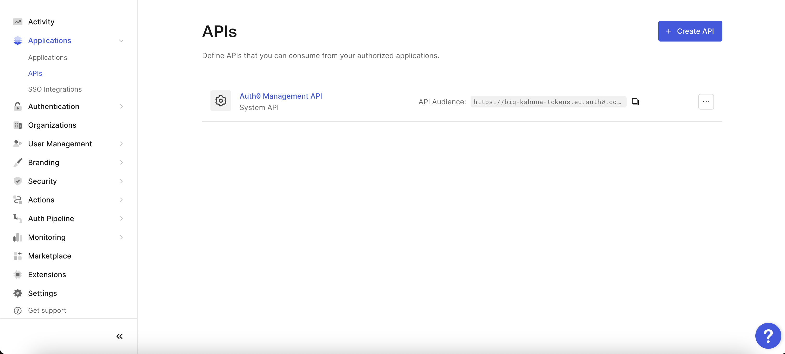
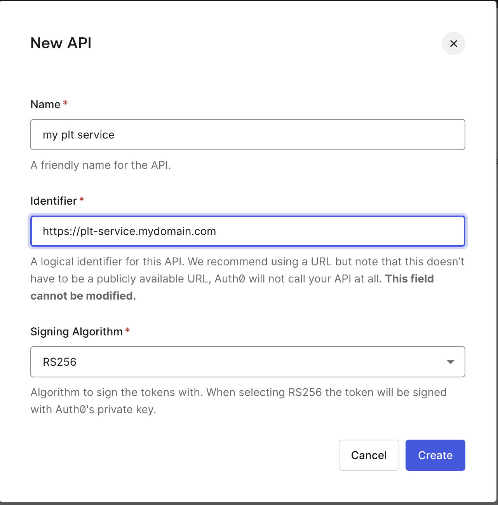
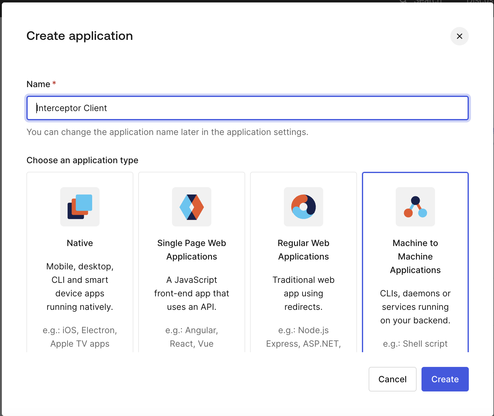
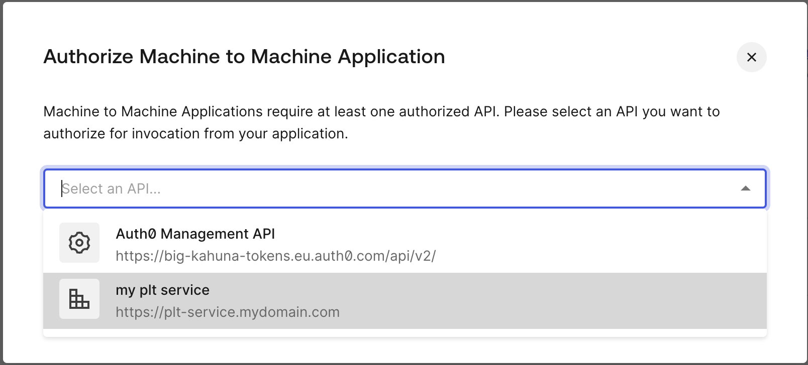
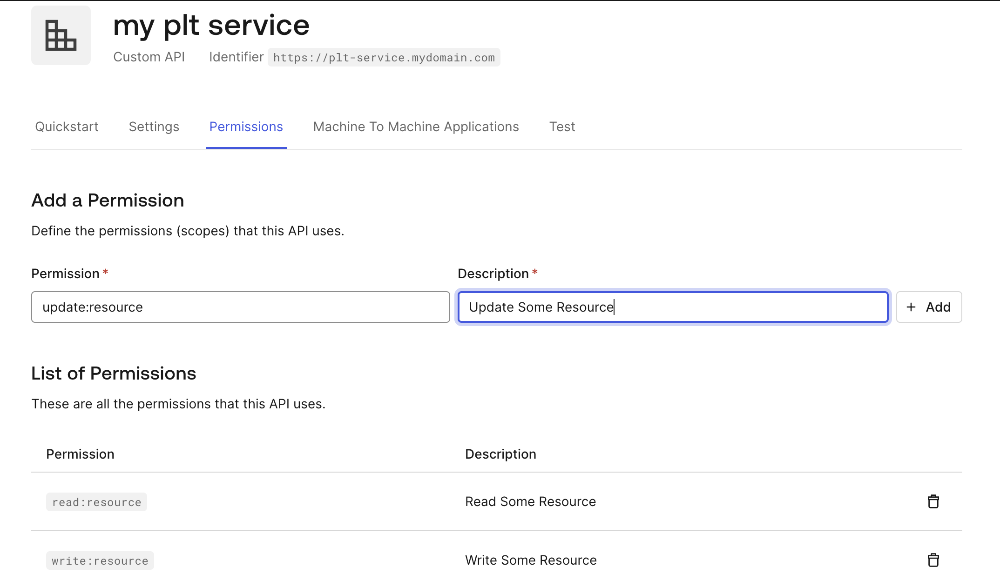
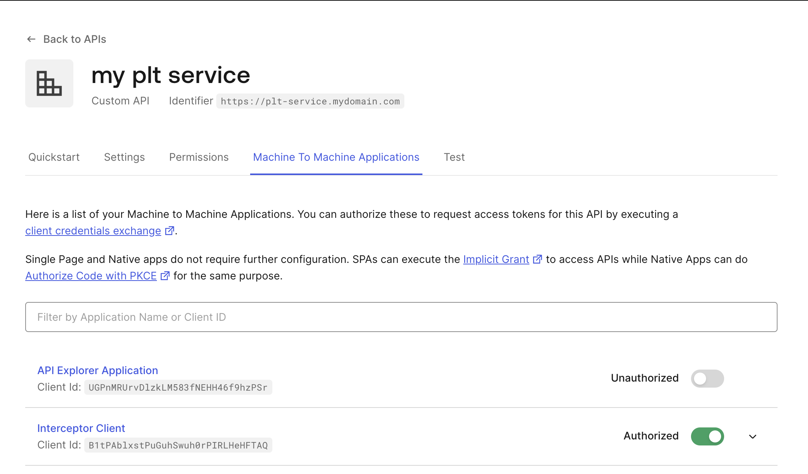
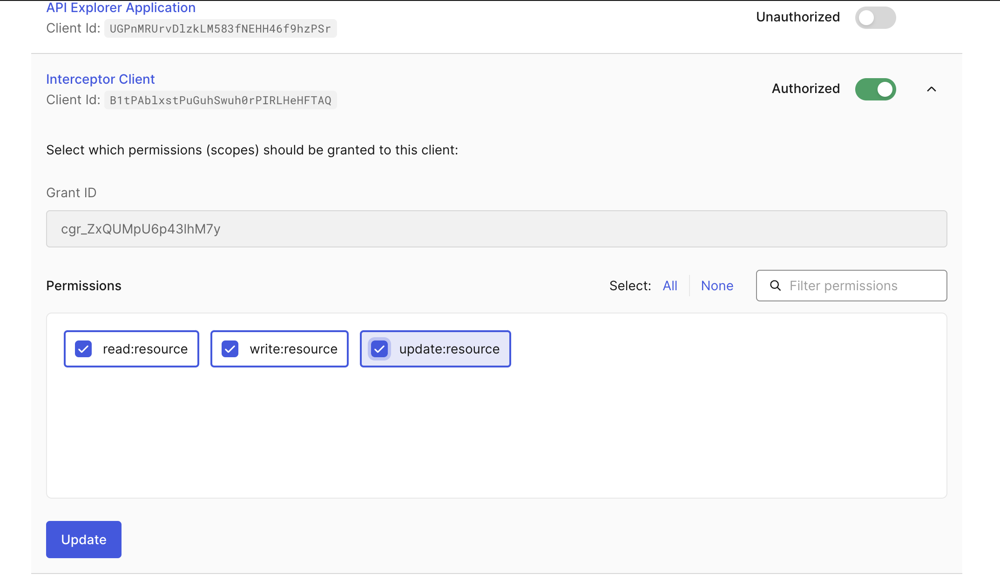

# Configure with Auth0

## Create API on Auth0

- Navigate to Applications > API


- Setup identifier for your service (API). This will be your `audience` parameter.


## Create a new OAuth2 Client (Application)

- Navigate to Applications > Applications


## Grant Access

- Grant Access to the API for your newly created application


# Define API permissions

- Navigate back to your API, and click `Permissions` tab




- Click next tab (Machine To Machine Applications) to allow these scopes to be requested by the client



- Select the scope you want to give this client access to



You can now request scope and audience from the interceptor:

```js
const interceptor = createOAuthInterceptor({
    idpTokenUrl: 'https://yourtenant.auth0.com/oauth/token', 
    // or https://idp.mydomain.com/oauth/token when using custom domains feature
    clientId: '', // copy from the Application -> your m2m application -> "Settings" Tab
    clientSecret: '', // copy from the Application -> your m2m application -> "Settings" Tab
    // Set an array of status codes that the interceptor should refresh and
    // retry the request on
    retryOnStatusCodes: [401],
    audience: '', // copy Identifier from "API" -> your service -> Settings tab
    scope: '' // space separated list of permissions required for this specific interceptor to operate that you have granted as described above
  })
```